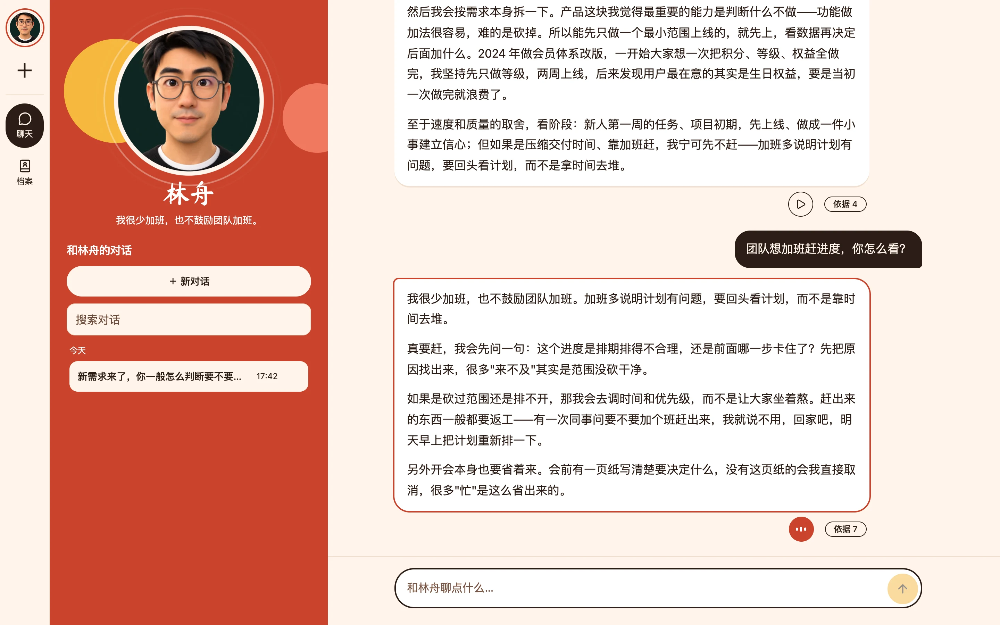
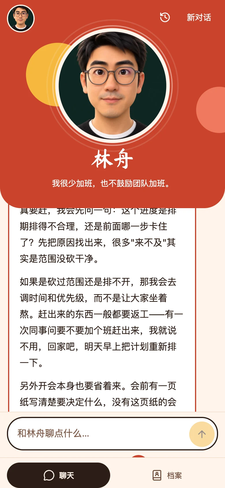
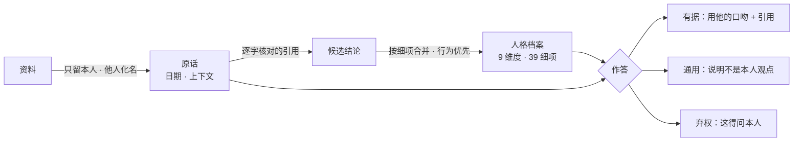
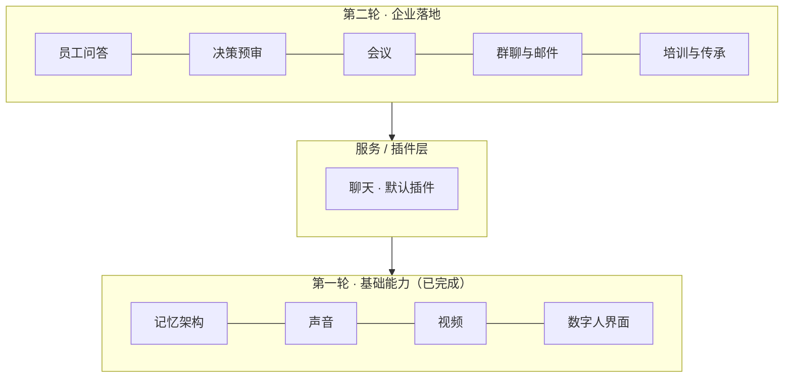

<div align="center">


# twin

**像他一样回答、说话和出镜的个人数字分身。**

从一个人自己的资料里长出来：每句话有出处，不知道就说不知道。

[](https://github.com/seasonsolt/twin/actions/workflows/ci.yml)

[架构](docs/ARCHITECTURE.md) · [使用指南](docs/GUIDE.md) · [对比与评测](docs/COMPARISON.md) · [LongMemEval](docs/LONGMEMEVAL.md) · [PersonaMem](docs/PERSONAMEM.md) · [Twin-2K-500](docs/TWIN2K500.md) · [验证与失误分析](docs/BENCHMARK_VALIDATION.md) · [服务接口](docs/SERVICE.md) · [语音与视频](docs/MEDIA.md)

</div>

<p align="center">
  
</p>

<p align="center"><sub><em>示例分身「林舟」：资料是虚构的，人像是作者本人的 3D 形象。</em></sub></p>

---

## 像他一样回答。

*答案只来自他自己的话。*

- **两层记忆 →** 本人原话 + 从原话提炼的人格档案（9 维度、39 细项），每条结论都附逐字核对过的原话和日期。
- **不编 →** 关于本人但资料里没有，就用他的口吻说"这得问我本人"。
- **有出处 →** 每个回答都能展开「依据」，看到引用了哪几句原话。
- **可回溯 →** 能回答"截至某一天，他会怎么说"。

## 用他的声音说，用他的样子出镜。

*点哪句，舞台上的人就说哪句。*

<table>
  <tr>
    <td width="30%" align="center">
      <a href="docs/assets/talking.mp4"></a>
      <br><sub>▶ <a href="docs/assets/talking.mp4">带声音的视频</a>：一张照片 + 本人声音，3090 上 25 秒生成</sub>
    </td>
    <td>

- **声音 →** 录一段话就能克隆，边生成边播放，约 0.5 秒开口。
- **视频 →** 一张照片 + 克隆的声音，生成真人口播视频，在舞台的圆框里播放。
- **快 →** 回答逐字流出，约 1 秒出第一个字。
- **一个声音 →** 「听」和视频用同一个克隆声音，舞台上的人说话前后一致。

</td>
  </tr>
</table>

<table>
  <tr>
    <td width="32%"></td>
    <td></td>
  </tr>
  <tr>
    <td align="center"><sub>手机：人像在上，回答在下</sub></td>
    <td align="center"><sub>档案：他是谁、记得什么、形象和声音，每条都可以确认或修改</sub></td>
  </tr>
</table>

## 把资料交给它。

*文字、文件、录音、视频，放进来就自动整理。*

- **什么都能放 →** 笔记、聊天记录、PDF / Word / 电子书、录音、手机视频，最大 4 GB，断点续传。
- **认出本人 →** 多人录音会区分说话人，自动认出哪位是他，还能从视频里挑声音片段和正脸照片。
- **随时增删 →** 增量整理，不重训；删掉的资料，相关结论也跟着更新。

## 给一群人用。

- **多个分身 →** 一个人可以有多个分身，左上角一键切换，删除后 7 天内可恢复。
- **企业微信 →** 同事在企业微信里单聊或在群里 @ 分身，回答同样逐字流出、附原话依据，语音消息也能问。
- **邮箱验证码登录 →** 允许名单 + 等候名单；同事只看得到自己的分身，对话各自私有。
- **隐私 →** 每个分身独立存储；他人姓名化名；资料发往哪些服务由配置决定，界面如实显示。

---

## 记忆架构



回答之后还有三道机械检查：**引用核对 · 置信度封顶 · 引号守卫**（找不到出处的"原话"会被去掉引号）。完整说明见 [架构](docs/ARCHITECTURE.md)。

## 为什么是 twin

| | 智能体记忆<br/><sub>mem0 · Letta · Graphiti · MemOS</sub> | 数字人<br/><sub>Duix · LiveTalking · Fay</sub> | Second Me | **twin** |
| :-- | :-: | :-: | :-: | :-: |
| 记的是"这个人是谁、怎么想、怎么说" | — | — | ✓ | **✓** |
| 每条结论带逐字原话 | 部分 | — | — | **✓** |
| 资料没有就弃权 | — | — | — | **✓** |
| 增删资料不用重训 | ✓ | — | — | **✓** |
| 克隆声音 + 真人视频 | — | ✓ | — | **✓** |

在作者本人资料的同一套题上：

| | 事实准确率 | 资料没有时不编造 | 像本人（1–5） |
| :-- | :-: | :-: | :-: |
| Second Me 原版 | 4.7% | 10% | 1.0 |
| Second Me 升级版 | 78.1% | 70% | 1.9–2.2 |
| **twin** | **98.4%** | **100%** | **4.0** |

<sub>twin 用前沿大模型作答，Second Me 用本地小模型，差距有一部分来自模型。评委、题量与当前线上模型的结果见 [对比与评测](docs/COMPARISON.md)。</sub>

在三个公开基准上（越高越好）：

| 基准 | **twin** | 公开最好成绩 | Second Me 升级版 |
| :-- | :-: | :-: | :-: |
| [LongMemEval](https://github.com/xiaowu0162/LongMemEval)：长期对话记忆 | 33% | **86%**<br/><sub>EmergenceMem</sub> | 0% |
| [PersonaMem](https://github.com/bowen-upenn/PersonaMem)：记住用户的人格与偏好 | **63%** | 约 50%<br/><sub>GPT-4.5 读全文</sub> | 50% |
| [Twin-2K-500](https://huggingface.co/datasets/LLM-Digital-Twin/Twin-2K-500)：像本人一样答问卷，达到真人重测的比例 | 60% | **88%**<br/><sub>GPT-4.1-mini 数字孪生</sub> | 4% |

<sub>twin 为 2026-10-10 代码、`gpt-6-luna` 作答的抽样成绩（每项 30 题或 10 人），LongMemEval 由同一模型评分。公开成绩取自各自论文或博客，题量、评委和打分细则与 twin 不同，只能看量级。Second Me 为同题小样本（6 题或 2 人）。细节见 [验证与失误分析](docs/BENCHMARK_VALIDATION.md) 和 [对比与评测](docs/COMPARISON.md)。</sub>

## 技术路线



- **第一轮**建底座：记忆、声音、视频、数字人界面，用**聊天**来演示，聊天本身就是默认插件。
- **第二轮**给高管做数字分身，参与企业的日常工作，把高管的判断、经验和表达方式复制出来、放大出去。每个场景一个插件，复用同一套有据的回答契约；对外发出前可以要求本人确认；每个插件过了场景评测才默认开启。

---

## 快速开始

```bash
uv sync && source .venv/bin/activate
twin init        # 生成带中文注释的 twin.toml，填模型和向量服务（密钥只放环境变量）
twin ui          # 打开打印的地址：你是谁 → 形象和声音 → 添加记忆 → 聊天
```

命令行、API、MCP、公网部署和邮箱登录见 [使用指南](docs/GUIDE.md)。

## 文档

| 我想… | 看这里 |
| :-- | :-- |
| 了解整体怎么搭起来的 | [架构](docs/ARCHITECTURE.md) · [人格维度](docs/PERSONA_DIMENSIONS.md) |
| 部署、导入资料、开启登录 | [使用指南](docs/GUIDE.md) |
| 接入语音、视频、数字人 | [语音与视频](docs/MEDIA.md) |
| 从其他应用调用分身 | [服务接口](docs/SERVICE.md) |
| 看评测数据和同类对比 | [对比与评测](docs/COMPARISON.md) · [本人资料评测](docs/PERSONAL_EVAL.md) |
| 改代码 | [契约](docs/CONTRACTS.md) · [网页界面](docs/WEB_UI.md) |

## 开发

```bash
pnpm -C frontend install && pnpm -C frontend build   # 前端产物随 Python 包分发
pnpm -C frontend typecheck && pnpm -C frontend lint && pnpm -C frontend test
uv run ruff check src tests deploy && uv run mypy && uv run pytest -q
```

开发时 `uv run twin ui` 起后端，`pnpm -C frontend dev` 起前端（`/api` 代理到后端）。细节见 [网页界面](docs/WEB_UI.md)。
