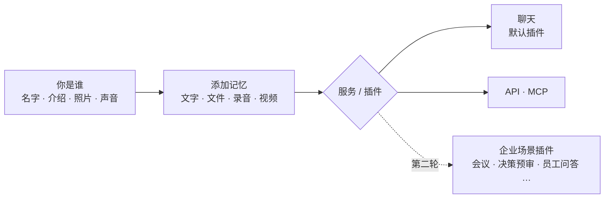
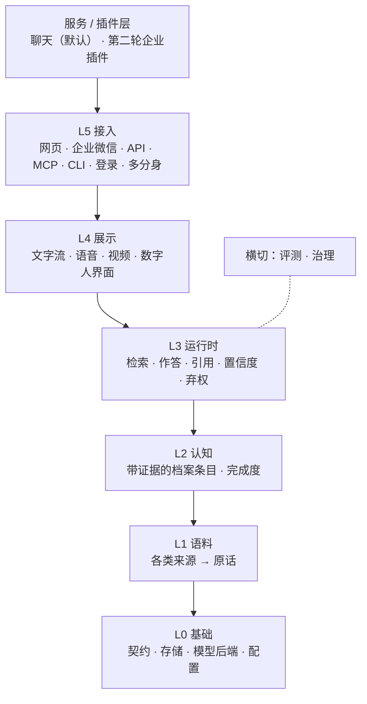
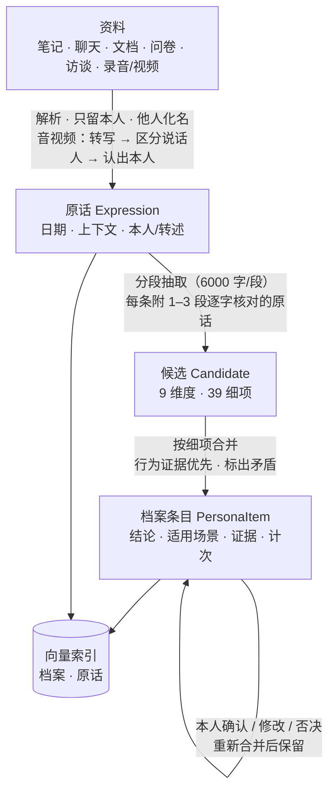
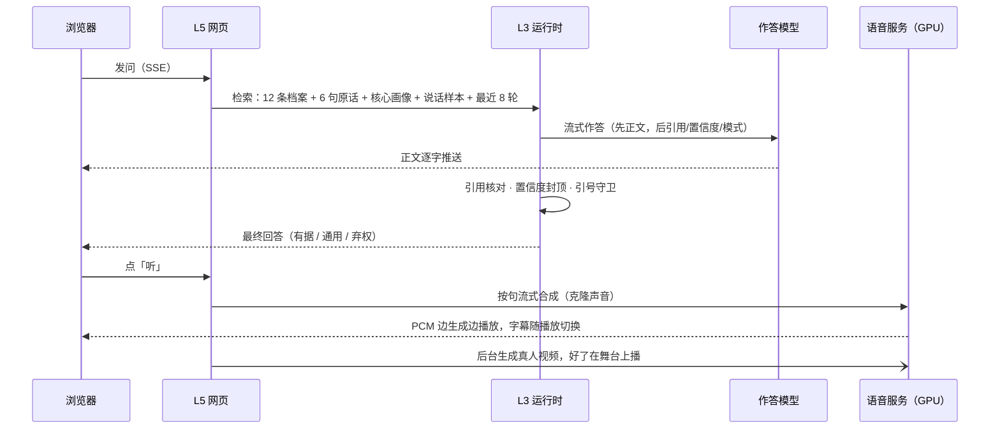
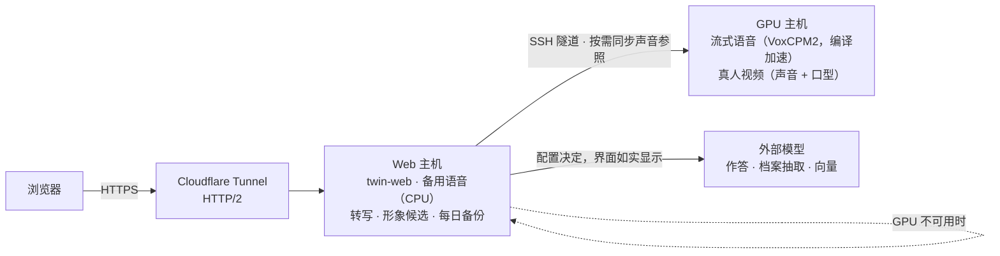
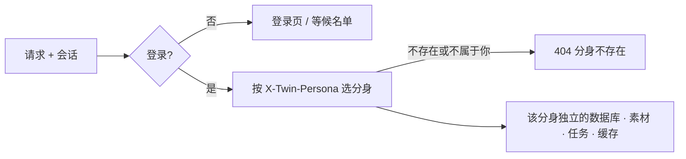

# twin 架构

## 1. 产品形态

回答的**内容**只来自 L3 运行时；声音、形象、视频只是呈现通道，不生成新内容。

## 2. 分层

| 层 | 代码层号（只用于 `tests/test_layers.py`） | 主要模块 |
| --- | --- | --- |
| L0 | 0 工具 · 1 契约 · 2 后端与配置 · 3 存储 | `util` `assets` · `persona.schema/items/dimensions` `media.schema` · `llm` `embed` `config` `media.tts/asr` · `persona.store` |
| L1 | 4 | `persona.sources` `persona.questionnaire` `persona.quotes` |
| L2 | 5 | `persona.profile` `persona.coverage` |
| L3 | 6 | `persona.chat` |
| L4 | 7 | `media.*`（脚本、语音文本、流式、渲染、视频、音视频入库、认人）`service` |
| 评测 | 8 | `evals.*` `media.check` |
| L5 | 9 | `cli` `web.*` `channels.wecom` `frontend/` `api` `mcp_server` |

## 3. 记忆：从资料到档案

- **增量、可重放**：分段、候选、条目的编号都是内容哈希；只抽新分段，只重合并变了的细项，输出逐细项增删改。
- **可按日期作答**：证据都带日期，`as_of` 只用那天之前的证据。
- **触发**：资料增删、身份修改都会排队重建；服务启动时自动续上未完成的整理和转写。

## 4. 作答：一次聊天的路径

| 模式 | 何时 | 置信度上限 |
| --- | --- | --- |
| 有据 | 本人的观点、经历、做法，资料里有 | 只引用未确认转述时 0.6 |
| 通用 | 与本人无关的知识和方法 | 0.5 |
| 弃权 | 关于本人但资料里没有；替本人承诺；评价具体他人 | 0.3 |

## 5. 部署（参考）

GPU 主机不可用时，语音和视频自动退回 Web 主机，只是更慢。

## 6. 多分身与权限

- 管理员管理全部分身；成员只管理自己的，默认最多 3 个。对话记录按登录的人隔离，管理员也看不到成员的对话。
- 每个分身一个目录（`personas/p-<id>/`，0700）；删除先进回收站，7 天内可恢复。
- 切换分身不重载页面：先预取新分身的资料和头像，再一次性切换；旧分身的播放和生成随之停止。
- 真人视频只用该分身自己的照片和声音，不会回退到别人的素材。

## 7. 层间规则

1. 依赖只向下，同层无环；新模块先在 `tests/test_layers.py` 登记。
2. 上游不知道下游：运行时不导入展示。
3. 每个边界一个契约 + 适配器：`Expression`（L1→L2）、档案条目（L2→L3）、`ChatReply` → `PresentableAnswer` / `ServiceAnswer`（L3→L4）、`SpeechSynthesizer` / `SpeechRecognizer`（L4→后端）、`SystemUnderTest`（评测）。
4. 契约变化记在 [CONTRACTS.md](CONTRACTS.md)；旧数据库仍可打开。
5. 后端用 `capabilities` 声明能力，上层据此选路径。
6. 错误统一转换，日志不含密钥、地址和原文。
7. 后端只经工厂构造；配置只写环境变量名，不写密钥。
8. 每个边界一套一致性测试，不联网。

## 8. 治理

- **证据优先**：没有逐字原话的结论不进档案；引用不到就降置信度或弃权。
- **本人同意**：用谁的脸和声音，须经其本人同意。
- **出境由配置决定**：配置了外部后端就是本人的选择，界面如实标出；转发到外部的本机代理要声明 `egress = "external"`。
- **他人保护**：他人姓名化名，对他人的评价不进档案。

## 9. 评测

- 用**本人真实资料**的题库：事实、资料里没有的问题、口吻、通用、记忆更新；题库和资料都在仓库外。
- 评委团、重复作答、按来源分组的置信区间、每次运行留来源记录；命令与口径见 [PERSONAL_EVAL.md](PERSONAL_EVAL.md)。
- 媒体另有回听评测（`twin media check`）：合成 → 识别 → 字错率。

## 10. 插件与路线

- **风格改写（L3，默认关闭）**：只改措辞不增删事实，改写后重新核对引用；LoRA 等只能这样接入，过评测才开。
- **外部接入**：其他应用经 API/MCP 用回答契约，业务规则不进分身内核。
- **路线**：第一轮建底座（记忆、声音、视频、数字人界面），用聊天演示；第二轮在服务／插件层做企业落地。见 README 的「技术路线」。
